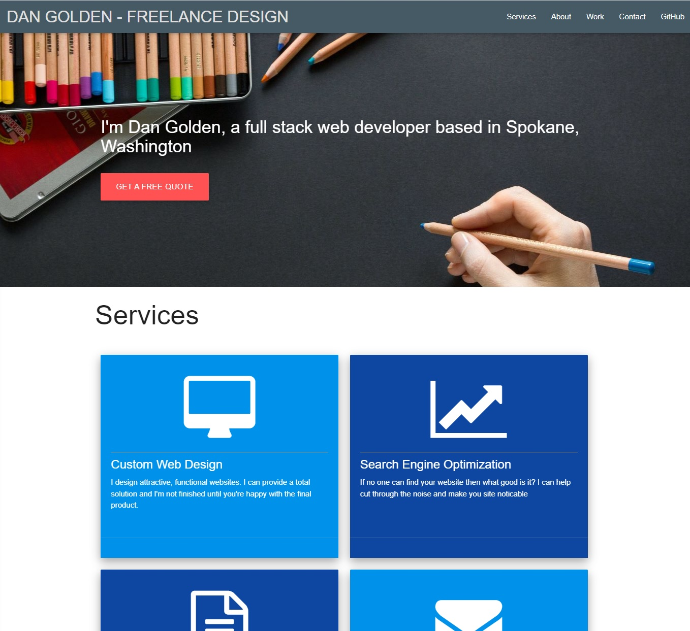

# Portfolio

### Homework Assignment Week 8

This is an updated portfolio now that we've had practice with both front and backend development along with an additional group project to share.  I'll be updating this page and other materials to build toward being employer-competitive.

***
### Features
* Updated portfolio featuring Project 1 (TuneSpace) and Project 2 (Digital Anvil) and other homework assignments
* Updated GitHub profile with pinned repositories featuring Project 1 and 2 and other homework assignments
* Updated resume
* Updated LinkedIn profile

***
### Example
The following image demonstrates the site's application appearance and functionality.

***
### Link To Deployed Site
[Portfolio](https://danpgolden.github.io/portfolio2/)

